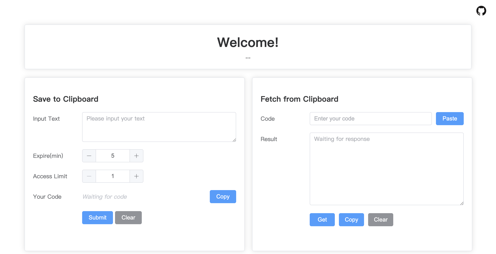

# Online Clipboard

A rusted online web clipboard. You can easily transfer content between different devices, or share with others.
一个生锈的在线剪贴板。你可以很方便地在不同设备间传输内容，或分享给他人。

## Features

- Web GUI clipboard based on VUE3
- backend web framework based on [Rocket](https://rocket.rs/)
- supports burn-after-reading

Preview:


## Quick Start

### Dependencies

Before you start, make sure you have installed the following dependencies:

1. [Rust](https://www.rust-lang.org/). If you in China mainland, you can use [rsproxy](https://rsproxy.cn/) to accelerate the download. 如果你在中国大陆地区，你可以使用 [rsproxy](https://rsproxy.cn/) 来加速下载。

2. [Redis](https://redis.io/). Make sure you have installed redis and started it. Remember to modify `backend/Config.toml` to your redis authentication info.

3. [yarn](https://classic.yarnpkg.com/lang/en/docs/install/#mac-stable). Make sure you have installed yarn, and then use `yarn` to install the frontend dependencies in the frontend directory. If it prompts that there are some missing dependencies, just install them.

> Tips: When you have installed rust and redis, you can use `cargo test` in the backend directory to make sure the backend server can work properly.

### Starting scripts

```bash
sh backend/start.sh
sh frontend/start.sh
```

You can open web GUI at http://localhost:8081 by default.

## Details

### How does it work


1. The user submits text.
2. The backend generates a hash code xxxx based on SHA-256.
3. Code xxxx is used as a key to save the text in Redis, and the backend server returns the code to the user for retrieval.
4. When the user retrieves the text with the correct verification code, the contents are returned to the user, and the access field is decremented by one. If access = 0, the contents will be destroyed.

## Acknowledgement

The frontend of this project was modified from [Juice_clipboard](https://github.com/ericjuice/Juice_clipboard), whose backend was written by Python 3. Thanks [Juice](https://blog.juis.top/). :)

## TODO

- [ ] docker-compose for one-click deployment
- [ ] support image and file